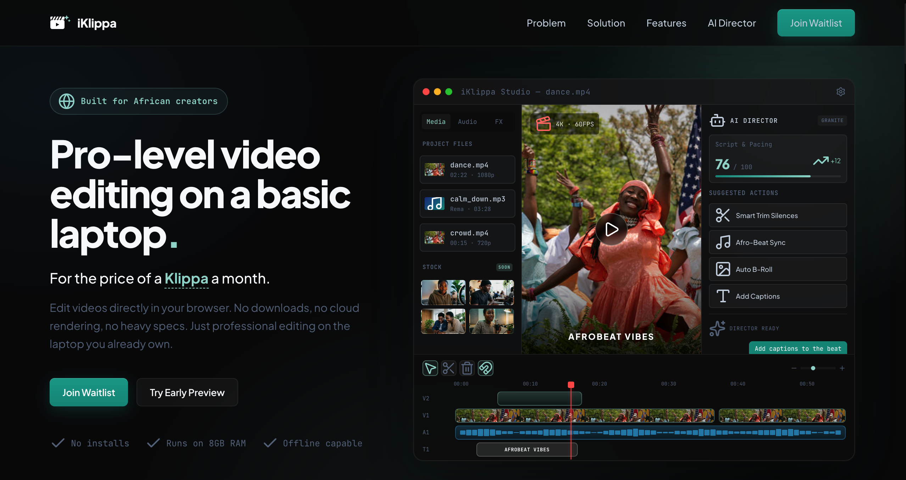
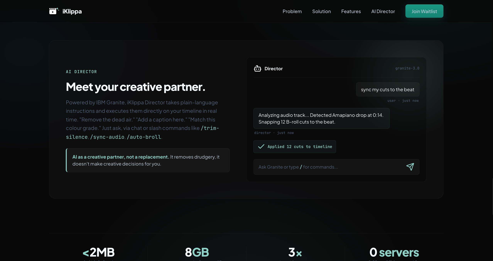
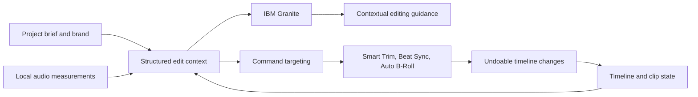
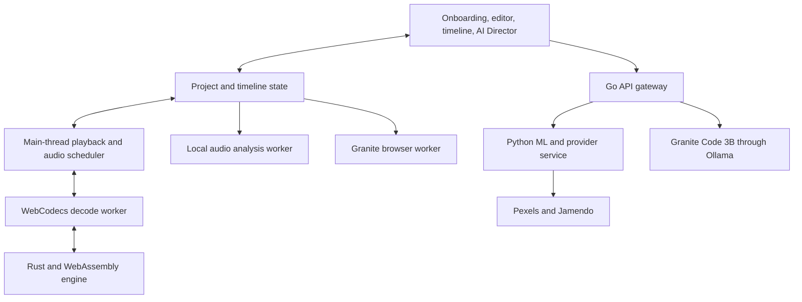

<div align="center">

# iKlippa

### The browser video editor where AI understands the edit, not just the prompt.

[](docs/bob-usage-log.md)
[](#how-ibm-technology-is-used)
[](#verification)
[](#offline-design)
[](LICENSE)

[Why AI-native?](#why-the-ai-is-not-an-add-on) |
[Features](#working-ai-features) |
[Architecture](#architecture) |
[Run locally](#run-locally) |
[IBM Bob](docs/bob-usage-log.md) |
[License](#license)

</div>

> [!NOTE]
> **Selected challenge:** July Challenge - Reimagine Creative Industries with AI

iKlippa helps creators turn raw footage into a finished cut without needing an expensive workstation, a permanent internet connection, or a collection of separate AI tools. It combines a custom browser video engine with IBM Granite, local audio analysis, stock media search, and timeline-aware editing commands.

<table>
  <tr>
    <td width="50%">
      
    </td>
    <td width="50%">
      
    </td>
  </tr>
  <tr>
    <td align="center"><strong>Built for modest hardware and unreliable connectivity</strong></td>
    <td align="center"><strong>Granite works from the timeline and applies real edits</strong></td>
  </tr>
</table>

## At a glance

| What makes iKlippa different | Proof in the prototype |
|---|---|
| AI receives the current edit as structured context | Project brief, brand rules, tracks, clips, selection, playhead, captions, pacing, and recent edits |
| AI actions change the real project | Smart Trim, Beat Sync, Auto B-Roll, `@clip` targeting, undo, and redo |
| Video processing stays local | WebCodecs, Web Audio, workers, Rust/WASM, IndexedDB, and browser export |
| Offline mode is verified | App shell, model, workers, WASM, and current media are checked before switching |
| The implementation is tested | 391 frontend tests, passing builds, and repeatable baseline and 4x CPU playback benchmarks |

## The problem

Video creators are expected to publish more content, in more formats, with faster turnaround times. The tools that can handle this work often assume:

- a powerful laptop;
- a stable, affordable internet connection;
- a monthly subscription priced in foreign currency;
- enough editing experience to perform repetitive timeline work by hand.

These assumptions leave many students, independent creators, small studios, and creators in bandwidth-constrained markets choosing between slow workflows and tools they cannot afford.

## The solution

iKlippa is a multi-track video editor built around three ideas:

1. **The browser can be the workstation.** WebCodecs handles hardware video and audio decoding, while Rust and WebAssembly handle timeline state, compositing, colour work, and effects.
2. **AI should understand the current edit.** Granite receives structured context from the project brief, brand rules, timeline, selected clips, playhead, captions, pacing measurements, and recent edits.
3. **AI suggestions should become real, reversible edits.** A deterministic command layer turns actions such as Smart Trim, Beat Sync, and Auto B-Roll into timeline mutations that can be undone.

The result is not a chatbot placed next to a normal editor. The edit itself is the AI's working context.

> [!IMPORTANT]
> Granite does not directly write arbitrary project state. It reasons over structured edit context, while a deterministic command layer validates targets and performs reversible timeline mutations. This keeps the AI useful without making the editor unpredictable.

## Why the AI is not an add-on

Most AI video tools start with a text prompt and generate an isolated output. iKlippa keeps the creator inside a real editing workflow.

The onboarding brief establishes the intended story, tone, visual keywords, brand name, palette, caption font, and brand rules. That information follows the project into the editor and is combined with live timeline state.

When a creator asks Granite about the cut, iKlippa provides:

- the project brief and brand direction;
- timeline duration, tracks, clips, and source offsets;
- selected clips and clips under or near the playhead;
- captions and clip metadata;
- recent AI edit markers;
- measured pacing, silence, gaps, and beat alignment.

When the creator runs an editing command, the system resolves the target from an `@clip` mention, the current selection, the playhead, or the full track. Local analysis then produces an edit plan and the editor applies it to the same timeline.



## Working AI features

| Feature | What it measures or understands | What it changes |
|---|---|---|
| Context-aware Granite | Brief, brand, tracks, clips, selection, playhead, captions, and measurements | Gives project-specific editing advice |
| Smart Trim | Decoded PCM, sustained silence, and empty timeline gaps | Creates ripple cuts and closes gaps |
| Beat Sync | Transient onsets, low-frequency energy, beats, and stronger drops | Aligns targeted clips to musical moments |
| Auto B-Roll | Explicit search text or onboarding keywords | Inserts downloaded Pexels footage on Video 2 |
| `@clip` targeting | Mention text, current selection, and playhead | Selects, highlights, and targets real clips |
| Cut score | Clip duration, pacing variation, silence, gaps, and beat alignment | Recalculates the score from the current project |

<details>
<summary><strong>How the two Granite modes work</strong></summary>

Granite can discuss the actual project rather than answering as a general chatbot. It prioritizes selected clips, clips at the playhead, and nearby clips, then uses the project script and brand rules to give practical editing guidance.

- **Online mode:** the Go gateway sends the structured prompt to a locally hosted IBM Granite Code 3B model through Ollama.
- **Offline mode:** the browser downloads and caches `granite-4.0-350m-ONNX-web` on first use. It runs in a worker through Transformers.js, using WebGPU with a WASM fallback.

The local model is downloaded only when the creator enables Offline mode. Loading progress is shown in the editor.

</details>

<details>
<summary><strong>How Smart Trim preserves the edit</strong></summary>

Smart Trim decodes source audio to PCM and analyzes it locally in a worker. It detects sustained silence, preserves short handles around speech, creates content ranges, removes silent ranges, and closes timeline gaps.

The resulting clips keep their source offsets, transforms, colour settings, effects, captions, and metadata. The whole action is undoable.

</details>

<details>
<summary><strong>Command examples</strong></summary>

```text
/trim-silence @Interview
/sync-audio @Opening
/auto-broll Johannesburg rugby crowd
```

</details>

## Video engine

The editor is not a collection of embedded media players. It has a custom non-linear editing pipeline:

- WebCodecs video and audio decoding;
- MP4 demuxing with MP4Box;
- a dedicated worker for decode and seek operations;
- a serial worker queue with stale sync requests coalesced;
- Rust and WebAssembly timeline state and frame processing;
- multi-track video compositing;
- per-clip colour grading and `.cube` LUT support;
- Web Audio mixing with track gain, pan, mute, and a master compressor;
- captions rendered on a synchronized overlay;
- H.264 and AAC export through WebCodecs and MP4 muxing;
- project save, restore, undo, and redo.

Source time and timeline time are kept separate. That allows clips to be trimmed, split, moved, and repeated while the decoder still reads the correct section of the original file.

## Performance evidence

The editor was tested with the real bundled 1280x720 H.264 video in Chrome. Each run uses a fresh browser profile, imports the source, places it on the timeline, and plays it for 12 seconds.

Values below are the median of four recorded runs. Parentheses show the full observed range.

| Measurement | Baseline | Chrome 4x CPU slowdown |
|---|---:|---:|
| Editor ready | 944.6 ms (884.2-965.2) | 1,222.3 ms (884.9-1,312.8) |
| Approximate frame rate | 60.0 FPS (30.0-60.0) | 43.1 FPS (30.0-60.0) |
| Dropped frames | 0.05% (0.0-2.8) | 2.1% (0.1-10.8) |
| Timeline advance in 12 seconds | 12.00 s (12.00-12.02) | 12.07 s (12.00-12.12) |
| Browser errors | 0 | 0 |

Every constrained run remained in real time and stayed at or above the 30 FPS usability floor.

> [!CAUTION]
> The 4x CPU run is a repeatable constrained-browser benchmark. Hardware capabilities vary, so physical low-spec device testing remains part of the validation roadmap.

Read the methodology, limitations, and reproduction steps in [the performance benchmark report](docs/performance-benchmark.md).

## Offline design

Offline mode is a product feature, not just a disconnected UI state.

When it is enabled, iKlippa verifies that:

- Granite Nano is cached in the browser;
- the application shell, workers, and WASM assets are cached;
- the current project's source media is stored in IndexedDB;
- browser storage is available for reopening the project.

Imported media stays on the device. Pexels and Jamendo search remain online-only because they depend on external providers.

### The Granite download is a one-time setup cost

The current Granite Nano package is approximately 676-678 MB. iKlippa does not download it during normal Online mode. The download starts only when the creator chooses Offline mode.

Transformers.js stores the model in the browser cache, and iKlippa requests durable browser storage. Later offline sessions reuse those local files without downloading the model again or sending prompts over the network.

A new download is needed only when:

- the creator clears the site's browser data;
- the browser evicts the stored model;
- the creator uses a different browser profile or device;
- iKlippa upgrades to a different model version.

This makes the model a larger first-time preparation step in exchange for private, repeatable inference without per-edit data use.

## Architecture



### Main components

| Component | Responsibility |
|---|---|
| `frontend/src/engine` | Decode, playback, seeking, audio scheduling, compositing, and export |
| `frontend/rust-engine` | Timeline model, effects, colour processing, and WASM bridge |
| `frontend/src/ai` | Granite context, local model worker, audio analysis, editor actions, and cut score |
| `frontend/src/commands` | Slash command parsing, `@clip` resolution, targeting, and execution |
| `frontend/src/project` | Onboarding, local project setup, brand context, and edit brief |
| `frontend/src/offline` | App-shell caching and offline readiness checks |
| `backend` | Go API gateway for Granite chat and stock provider routes |
| `ml` | FastAPI service for script analysis, stock search, music search, and the XGBoost model |

More detail is available in [the frontend architecture notes](frontend/architecture.md).

## How IBM technology is used

### IBM Bob

IBM Bob was the primary development tool used to inspect the existing codebase, plan cross-file changes, implement features, debug browser media problems, and run verification. The team reviewed the plans and code, tested the real browser workflow, and made the product and architecture decisions.

The detailed record is in [the IBM Bob usage log](docs/bob-usage-log.md).

### IBM Granite

IBM Granite is a core runtime component:

- Granite receives the current edit as structured context;
- Granite provides project-specific editing guidance;
- Granite Code 3B supports the online development setup through Ollama;
- Granite 4.0 350M runs inside the browser for offline chat.

Granite is paired with local measurements and deterministic editing commands so the product does more than generate text.

## Challenge fit

iKlippa directly addresses the July challenge goal of transforming how creative work is produced and experienced.

- **AI creative partner:** Granite works with the creator's existing footage, timeline, and intent.
- **Faster creation:** local silence detection, beat analysis, contextual advice, and stock insertion remove repetitive work.
- **New workflow:** the same editor can move between online assistance and fully on-device Granite.
- **From imagination to execution:** onboarding turns a rough idea into persistent creative direction used throughout the edit.
- **Human control:** edits remain visible, targetable, reversible, and adjustable on a professional timeline.

## Real-world value

iKlippa is designed for creators whose constraints are normally treated as edge cases:

- lower hardware requirements through browser hardware decoding;
- private local media processing;
- reduced dependence on cloud rendering;
- offline reopening after assets and the local model are cached;
- culturally relevant rhythm analysis;
- familiar timeline controls rather than a prompt-only workflow.

The immediate users are student creators, independent editors, social media teams, small studios, and community organizations producing short-form video.

## Run locally

The core editor needs only Node.js and a Chromium-based browser with WebCodecs support.

```bash
cd frontend
npm install
npm run dev
```

Open [http://localhost:8080/](http://localhost:8080/).

This starts onboarding, the multi-track editor, local media processing, Smart Trim, Beat Sync, export, project persistence, and Offline mode. The first Offline mode setup downloads Granite 4.0 350M and then caches it for later use.

> [!IMPORTANT]
> Do not open `frontend/index.html` directly. The Vite server provides worker loading and the cross-origin isolation headers required by the editor.

### What each setup enables

| Setup | Available features |
|---|---|
| Frontend only | Onboarding, editor, local media, Smart Trim, Beat Sync, export, save/restore, and Offline Granite after its first download |
| Frontend + Go + Ollama | Online Granite chat |
| Full stack | Online Granite, Pexels video, Jamendo music, script analysis, and virality model |

<details>
<summary><strong>Enable optional online Granite and stock services</strong></summary>

#### Requirements

- Go 1.21 or newer
- Python 3.10 or newer
- Ollama
- Pexels and Jamendo credentials for stock search

#### Configure provider keys

```bash
cp ml/.env.example ml/.env
```

```dotenv
PEXELS_API_KEY=your_pexels_api_key
JAMENDO_CLIENT_ID=your_jamendo_client_id
```

#### Install the optional services

```bash
cd ml
python -m venv .venv
source .venv/bin/activate
pip install -r requirements.txt
```

```bash
cd backend
go mod download
```

#### Start the services

Run each command in a separate terminal from the repository root:

```bash
ollama run granite-code:3b
```

```bash
cd ml
source .venv/bin/activate
python app.py
```

```bash
cd backend
go run .
```

The Vite frontend proxies `/api` to the Go service on port `8081`. The Go service connects to Ollama and the Python service on port `8000`.

</details>

## Verification

```bash
cd frontend
npm test
npm run build
```

```bash
cd backend
go test ./...
```

Current frontend result:

```text
35 test files passed
391 tests passed
TypeScript and production build passed
```

The test suite covers the editor state, worker protocol, playback, audio scheduling, thumbnails, timeline controls, drag and drop, onboarding persistence, command targeting, local audio math, AI timeline actions, cut scoring, stock provider errors, Granite runtime selection, and offline readiness.

Run the repeatable Chrome playback benchmark:

```bash
cd frontend
node scripts/benchmark.mjs
```

## Known limits

- The first Offline mode setup requires an internet connection to download Granite 4.0 350M.
- WebGPU is preferred for the browser model. WASM is the slower fallback.
- Pexels and Jamendo searches require an internet connection and valid provider credentials.
- WebCodecs support and accepted media codecs vary by browser and operating system.
- The constrained CPU benchmark is complete, but the physical 8 GB target-laptop test remains pending.
- Automatic captions are present in the editor, but the current hackathon demo focuses on the completed Smart Trim, Beat Sync, Auto B-Roll, and contextual Granite paths.

## Repository structure

```text
iKlippa/
|-- backend/       Go API gateway
|-- docs/          IBM Bob record, benchmark report, and submission images
|-- frontend/      Browser editor, workers, tests, and Rust/WASM engine
|-- ml/            Script analysis, stock providers, and XGBoost model
|-- Cargo.toml     Rust workspace
`-- README.md      Project overview and setup
```

## Team

- **Elvis Chege:** frontend systems, browser media engine, Rust/WASM, and editor experience
- **Mphele:** backend, model orchestration, ML services, and provider integrations

## Project status

iKlippa is a working hackathon prototype. The editor, AI context path, local editing actions, offline readiness checks, stock media workflow, and export pipeline are implemented. The next stage is broader codec testing, low-end hardware benchmarking, and creator testing.

## License

iKlippa is licensed under the [Apache License 2.0](LICENSE).
