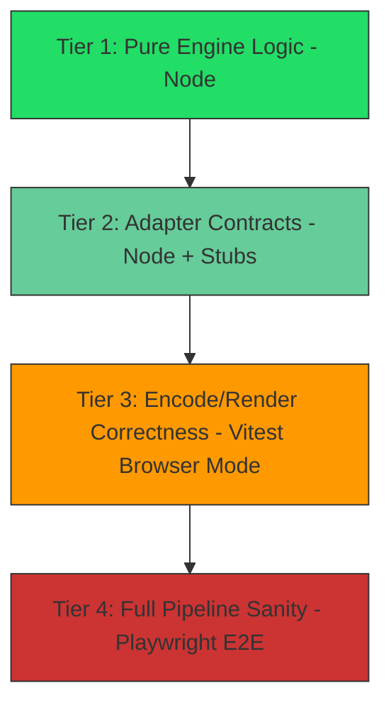

# iKlippa Test Architecture & Strategy

This document outlines the testing strategy for the iKlippa media engine. Testing heavily browser-coupled APIs (WebCodecs, Web Audio, Canvas, MP4Muxer) requires a tiered approach. We cannot rely purely on Node mocks, nor can we run everything in a slow E2E framework.

We will adopt a **Hybrid Testing Strategy using the Adapter Pattern**, organized into the following pyramid:


*Volume/speed decreases top to bottom: hundreds of instant Tier 1 tests, down to a handful of slow Tier 4 tests.*

## 1. Architectural Prerequisite: The Adapter Pattern

Before writing tests, we must untangle our pure business logic from direct browser API calls (`VideoEncoder`, `AudioContext`, `canvas.getContext()`).

**The Refactor:**
We will introduce an **Adapter/Port Layer**, injected into the engine rather than constructed internally.

- **Pure Logic:** State management (`src/state/state.ts`), timeline math, clip trimming, frame timestamp math, and effect resolution. No browser API references at all.
- **Adapters:** Thin wrappers like `VideoEncoderPort`, `AudioGraphPort`, and `CanvasRendererPort` that expose simple interfaces and encapsulate the raw native browser objects.
- **Dependency Injection:** The engine must accept adapter factories (`encoderFactory`, `audioContextFactory`, etc.) as constructor/init parameters, never call `new VideoEncoder(...)` directly inside engine logic. This is what makes every tier below possible without global patching.

This allows us to test the majority of our engine in pure Node.js without needing any DOM or WebCodecs overhead.

## 2. Directory & Naming Conventions

```
src/
  engine/           # engine.ts, worker.ts — orchestration only, no direct browser calls
  adapters/         # VideoEncoderPort, AudioGraphPort, CanvasRendererPort
  state/            # pure state/reducer logic
tests/
  unit/             # Tier 1 — pure logic, *.test.ts
  adapters/         # Tier 2 — adapter contract tests, *.test.ts
  fakes/            # Hand-rolled fakes: FakeVideoEncoder.ts, FakeAudioContext.ts, etc.
  browser/          # Tier 3 — Vitest Browser Mode specs, *.browser.test.ts
e2e/
  golden-paths/     # Tier 4 — Playwright specs, *.spec.ts
```

**Which tier does a new test belong in?** Ask in order:

1. Does it touch timeline/state/math with no adapter involved? → **Tier 1**, `tests/unit/`.
2. Does it exercise an adapter against a hand-rolled fake (no real browser API)? → **Tier 2**, `tests/adapters/`.
3. Does it need a *real* `VideoEncoder`, `AudioContext`, or WebGL context to validate actual output? → **Tier 3**, `tests/browser/`.
4. Does it drive the full UI end-to-end (import → edit → export)? → **Tier 4**, `e2e/golden-paths/`.

If a test could live in Tier 1 or 2, prefer Tier 1. If it could live in Tier 2 or 3, prefer Tier 2 — only escalate to a real browser when the fake genuinely can't validate the behavior in question (e.g., actual codec acceptance of a config).

## 3. The Four Testing Tiers

### Tier 1: Pure Engine Logic (Vitest + Node)

- **Target:** Timeline scheduling, state mutations, math, sorting, clipping logic, Mp4Muxer wrapper logic (against synthetic `Uint8Array` chunk data — Mp4Muxer itself has no browser dependency).
- **Environment:** Pure Node.js. Zero mocks, zero globals stubbed.
- **Execution:** Runs in milliseconds on every keystroke (`vitest --watch`).
- **Files:** `tests/unit/*.test.ts`.

### Tier 2: Adapter Contracts & Lifecycle (Vitest + Node + Hand-Rolled Stubs)

- **Target:** The Adapter Layer (`VideoEncoderPort`, `AudioGraphPort`).
- **Environment:** Node.js with `vi.stubGlobal`.
- **Strategy:** Hand-roll minimal fakes for `VideoEncoder`, `VideoFrame`, and `AudioData`, living in `tests/fakes/`. These are shared across all Tier 2 tests — do not redefine ad hoc per test file.

**Leak-detection mechanism (required, not optional):**

Every fake resource (`FakeVideoFrame`, `FakeAudioData`) registers itself in a module-level `Set` on construction and removes itself on `.close()`. A shared `expectNoLeaks()` helper, called in `afterEach`, asserts that set is empty and throws with the stack trace of whichever object wasn't closed. Calling any method on an already-closed fake throws `InvalidStateError`, matching real WebCodecs behavior. This is the *one* leak-tracking pattern for the whole codebase — do not let individual test files invent their own.

**TypeScript configuration:** Tier 1/2 tests run in Node, but adapters reference `VideoFrame`/`VideoEncoder` types from `lib.dom.d.ts`. Include `"dom"` in `tsconfig`'s `lib` for **type-checking only** — never import or rely on real DOM globals being present at runtime in these tiers. If this distinction gets blurry, isolate WebCodecs type declarations into a local `.d.ts` shim instead of pulling in the full DOM lib.

> [!WARNING]
> Do **not** use `jsdom` or `happy-dom` for Tier 1 or Tier 2. They add overhead and do not implement WebCodecs or real Web Audio processing — they'd give a false sense of browser fidelity while still leaving the APIs that actually matter unimplemented.

- **Execution:** Fast, runs in watch mode.

### Tier 3: Real Encode/Render Correctness (Vitest Browser Mode)

- **Target:** Pixel format handling, codec configuration acceptance, shader output, timestamp accuracy during real encoding.
- **Environment:** `Vitest Browser Mode` via the Playwright provider, headless Chromium.
- **Strategy:** Drive the actual engine against headless Chrome with real `VideoEncoder` pipelines, real `AudioContext` graphs (prefer `OfflineAudioContext` for deterministic, synchronous rendering), and real Canvas/WebGL rendering.

**Assertion policy — structural, not byte-exact:** Headless CI (no GPU) and a local Apple Silicon machine (hardware VideoToolbox encode available) can take different codec paths for the same input and produce different bitstreams. Tests must assert on:
- chunk count and keyframe/delta pattern (`chunk.type`)
- output byte-size within a tolerance range, not an exact value
- decodability (round-trip: encode → decode → compare pixel data within a tolerance), not raw bitstream equality

Never assert exact byte content of an `EncodedVideoChunk`. Before running an encode test, check `VideoEncoder.isConfigSupported()` for the codec under test and skip gracefully if unsupported in that environment, rather than failing.

- **Execution:** Slower (~1–3 min for the suite). Runs in CI on every PR, not required for local instant feedback.

### Tier 4: E2E Pipeline Sanity (Playwright)

- **Target:** The "Golden Path" user flow only.
- **Strategy:** Drive the full UI to import a clip, make a trim, apply an effect, and export the project. Validate the resulting `.mp4` with a small Node validator script (e.g. via `mp4box.js` or `ffprobe`) checking duration, codec, and container validity — not frame-level pixel content.
- **Execution:** Slowest (5–15 min). Reserved strictly for golden paths and major regressions. **Do not test engine edge cases here** — if a Tier 4 test fails, you should already suspect it's a wiring/integration issue, because the codec/render logic itself is already covered at Tier 3.

## 4. Coverage Policy

- Tier 1 and Tier 2 coverage is collected automatically via Vitest's `v8` provider.
- Tier 3 coverage requires confirming the coverage provider is applied to the browser workspace/project specifically — multi-project Vitest configs can silently collect coverage from only the default project.
- Tier 4 (Playwright) does **not** feed into Vitest's coverage report automatically. If E2E coverage is desired, instrument the build with `istanbul` (e.g. `vite-plugin-istanbul`), extract `window.__coverage__` after each run, and merge with Vitest's output (`nyc merge` or equivalent) before generating the final report.
- Default policy: **Tiers 1–3 count toward the coverage gate; Tier 4 is a regression guard only and is excluded from the coverage number.**

## 5. Next Steps for Implementation

1. **Refactoring Phase:** Identify direct WebCodecs/WebAudio calls in `src/engine/engine.ts` and `src/engine/worker.ts` and extract them into discrete Adapter classes, injected via factories.
2. **Fakes Suite:** Build the shared hand-rolled fakes in `tests/fakes/` with the leak-registry pattern described in §3 (Tier 2).
3. **Vitest Config:** Set up `@vitest/browser` with the Playwright provider as a separate workspace/project, with `v8` coverage explicitly configured for it.
4. **Migration:** Move existing Node-based `engine.test.ts` integration tests (currently struggling with mocked browser APIs) into the new Tier 3 Browser Mode suite, rewriting byte-exact assertions as structural ones per §3.
5. **CI:** Add `npx playwright install chromium` to the pipeline; set `testTimeout` generously (≥30s) for Tier 3/4 encode-related tests to absorb transient encoder latency.